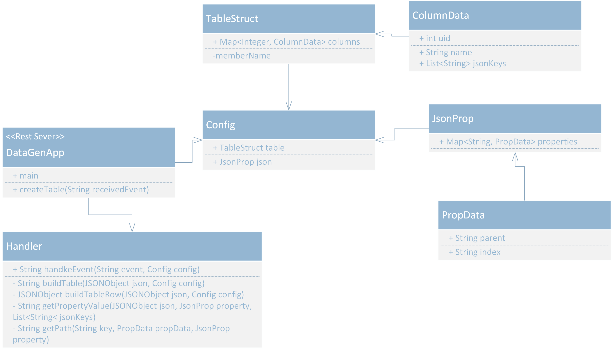
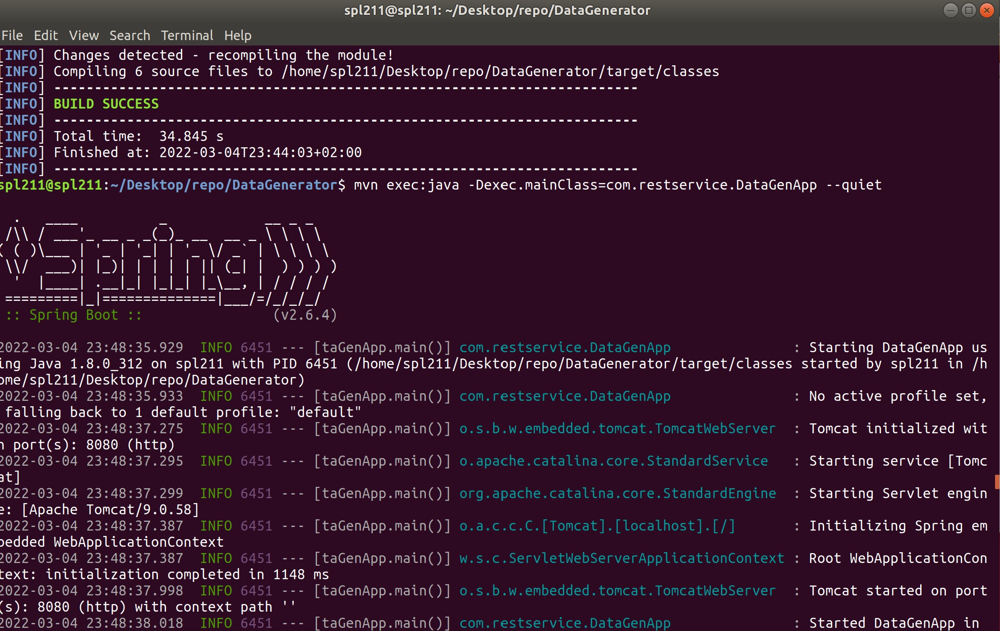
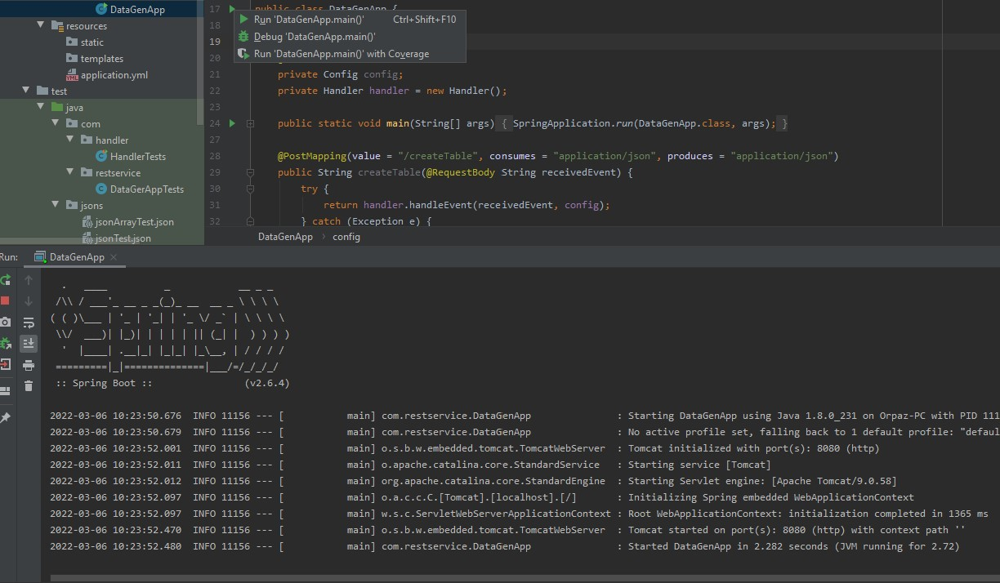

# DataGenerator
This service receives “events” asynchronously with “evidence” objects in the format of JSON and convert them into a structured table based on configuration.
## Project Structure
```$xslt
+- src
    +- main
        +- java.com
            +- configuration
                | +- Config
                | +- JsonProp
                | +- PropData
                | +- TableStruct
            +- generator
                | +- Handler
            +- restservice
                | +- DataGenApp
        +- resources
            | +- application.yml
    +- test
```
## Code
The modules containing this project are:
1. **Configuration** - contains all the objects that holds all the data from the configuration file.
This objects hold the table structure, and the json property needed to create the table. 
1. **Generator** - responsible to build the result table according to the struct in the configuration file, extract all the necessary values and return the table as json object. 
1. **Rest Service** - the restAPI, spring service that received the json from the user and pass it to the handler.


#### Configuration File
The configuration file `application.yml` can be found at `src\main\resources`.
It consist of two sections: `table` and `json`.
*  The `table` section hold the `columns`, and each columns contains unique id (serial number), the column name and the relevant properties from the json file that their data needs to be in this column.
```yaml
table:
    columns:
      1:
        name: id
        jsonkeys: [evidence_id]
      2:
        name: full name
        jsonkeys: [first_name, last_name]
```
* The `json` section contains all the relevant properties from the json that the program need to in order to create the table.
all are under `properties`.
```yaml
json:
    properties:
      evidence_id:
        parent: none
      evidence_data:
        parent: none
      user-details:
        parent: evidence_data
        index: 0
```
each property key is the property name as appear in the json file, the `parent` is the direct parent property of it, and the `index` in the property index in case the parent property type is array.
the `index` property is no mandatory and can be `null`.
## How To Use
###1) Start the server
####Option 1: CMD
* At the git folder build the project with the command
```shell script
> mvn compile
```
* To start the server via spring run
```shell script
> mvn exec:java -Dexec.mainClass=com.restservice.DataGenApp --quiet
```
now the server is up and listen through the port writen in the cmd, the default port is `8080`.


####option 2: Intellij UI
Run the main function at DataGenApp, to open up a port to the server.


###2) Send Json File
To send a raw json file to the server send a POST request via `/createTable` method
```
localhost:8080/createTable
``` 
* To send nore than one json file wrapped it with `"data"` array:
```json
{
  "data": [{
    "evidence_id":"1"
  },{
    "evidence_id":"2"
  },{
    "evidence_id":"3"
  }
  ]}
```

### Requirements
```text
java version 1.8.0_312
maven version 3.6.0
maven dependencies:
    - org.json version 20211205
    - com.jayway.jsonpath version 2.7.0
    - junit version 4.13.2
```


