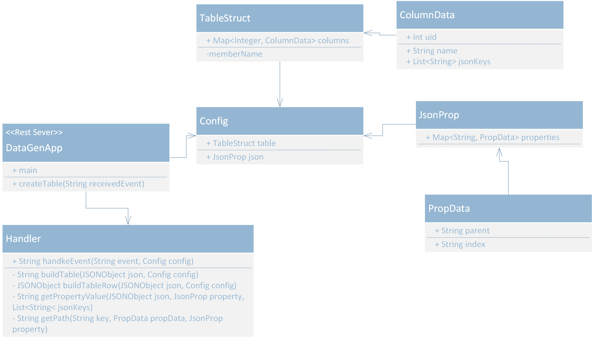

# DataGenerator
This service receives “events” asynchronously with “evidence” objects in the format of JSON and convert them into a structured table based on configuration.
## Project Structure
```$xslt
+- src
    +- main
        +- java.com
            +- configuration
                | +- Config
                | +- JsonProp
                | +- PropData
                | +- TableStruct
            +- generator
                | +- Handler
            +- restservice
                | +- DataGenApp
        +- resources
            | +- application.yml
    +- test
```
## Code Style

#### Configuration File
## Tests
## How To Use
### Requirements

